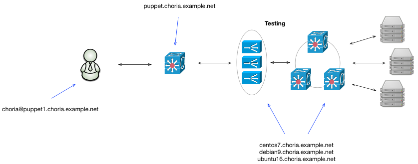

Choria AWS Test Suite
---------------------

This repository builds a Choria test environment and includes a suite of tests that verify its functionality.

  * Mix network of CentOS 7, Debian 9, Ubuntu LTS and Archlinux all set up with the official Choria Puppetm modules
  * CentOS based Puppet Server with a Choria Network Broker
  * 3 node Network Broker Cluster running on CentOS, Debian and Ubuntu nodes
  * Federation Brokers on each of the 3 node Network Broker Cluster
  * Various common Choria agents deployed
  * Test suite implimented using Choria Playbooks
  * Most of the configuration is done using SRV records



The purpose is this to eventually build automated testing that would let us test things like updating PuppetDB and other components.

The test suite today is a bit limited but will grow over time as the suite matures.

## Starting

Create `terraform/terraform.tfvars` with something like:

```ini
access_key = "AKEY"
secret_key = "SKEY"
ssh_key = "you@your.example.net"
```

You'll already have to have your ssh key known to AWS for this to work.

By default it uses the `eu-central-1` region, there are lots you can configure in `variables.tf` via `terraform.tfvars`.

Run `terraform apply` and eventually you'll have output shown with the nodes listed.

All nodes have a `choria` user with your SSH key except the Archlinux one that uses `root`


## Confirming it's up

It takes a while to get going since it builds Puppet Server, PuppetDB etc it can be up to 10 minutes or more.  You can log into the Puppet Server node and check it's log file till cloud init it done.

```
sudo tail -f /var/log/messages
....
Apr  9 09:54:54 localhost cloud-init: Cloud-init v. 0.7.9 finished at Mon, 09 Apr 2018 09:54:54 +0000. Datasource DataSourceEc2.  Up 378.41 seconds
```

At this point create a certificate for the user:

```
$ mco choria request_cert
Requesting certificate for '/home/choria/.puppetlabs/etc/puppet/ssl/certs/choria.mcollective.pem'
Waiting up to 240 seconds for it to be signed

Certificate /home/choria/.puppetlabs/etc/puppet/ssl/certs/choria.mcollective.pem has been stored in /home/choria/.puppetlabs/etc/puppet/ssl
```

And you should see 5 nodes respond to pings:

```
$ mco ping
archlinux1.choria.example.net            time=46.64 ms
centos7.choria.example.net               time=47.43 ms
debian9.choria.example.net               time=48.11 ms
ubuntu16.choria.example.net              time=48.74 ms
puppet.choria.example.net                time=49.24 ms


---- ping statistics ----
5 replies max: 49.24 min: 46.64 avg: 48.03
```

Now the test suite can be run:

It will do pre-flight things like forcing a Puppet run everywhere to ensure PuppetDB is up to date - here you'll see some warnings about assertion failed that is normal.

The test suite will follow with a report at the end.

```
$ cp /etc/puppetlabs/code/environments/production/suite.yaml .
$ mco playbook run cspec::suite --modulepath /etc/puppetlabs/code/environments/production/site:/etc/puppetlabs/code/environments/production/modules --data suite.yaml --report `pwd`/out.json
Notice: Scope(<module>/cspec/plans/run_suites.pp, 7): Running test suites:
        cspec::discovery
        cspec::choria
        cspec::agents::shell
        cspec::agents::process
        cspec::agents::filemgr
        cspec::agents::nettest
Notice: >>>
Notice: >>> Starting test suite: mc discovery method
Notice: >>>
.
.
.
.
Plan cspec::suite ran in 62.30 seconds: OK

Result:

     {
       "testsuites": [
         {
           "name": "mc discovery method",
           "cases": 4,
           "success": true
         },
         {
           "name": "choria discovery method",
           "cases": 4,
           "success": true
         },
         {
           "name": "choria tests",
           "cases": 1,
           "success": true
         },
         {
           "name": "shell agent tests",
           "cases": 1,
           "success": true
         },
         {
           "name": "process agent tests",
           "cases": 1,
           "success": true
         },
         {
           "name": "filemgr agent tests",
           "cases": 2,
           "success": true
         },
         {
           "name": "nettest agent tests",
           "cases": 2,
           "success": true
         }
       ],
       "success": true
     }
```
